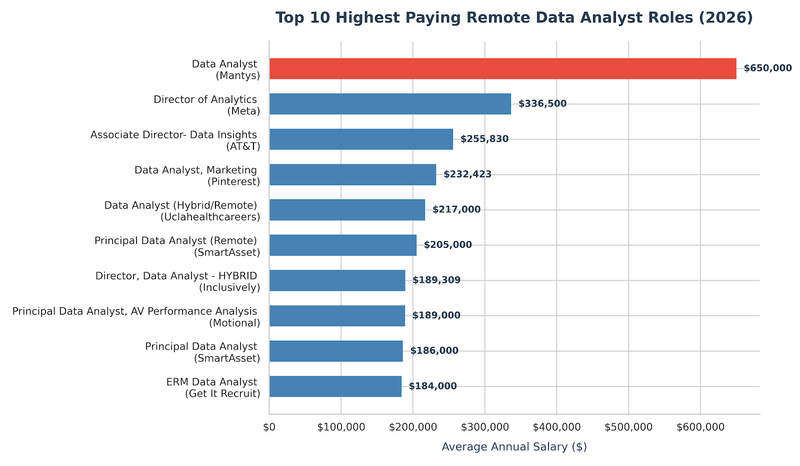

# Introduction
📊 Dive into the data job market! Focusing on data 
analyst roles, this project explores 💰 top-paying jobs,
 🔥 in-demand skills, and 📈 where high
  demand meets high salary in data analytics.  

 🔍 SQL queries? Check them out here: [project_sql folder](/project_sql/)
# Background
Driven by a quest to navigate the data analyst job market more effectively, this project was born from a desire to pinpoint top-paid and in-demand skills, streamlining others work to find optimal jobs.

### The questions I wanted to answer through my SQL queries were:

1. What are the top-paying data analyst jobs?
2. What skills are required for these top-paying jobs?
3. What skills are most in demand for data analysts?
4. Which skills are associated with higher salaries?
5. What are the most optimal skills to learn?
# Tools I used
For my deep dive into the data analyst job market, I harnessed the power of several key tools:

- **SQL:** The backbone of my analysis, allowing me to query the database and unearth critical insights.
- **PostgreSQL:** The chosen database management system, ideal for handling the job posting data.
- **Visual Studio Code:** My go-to for database management and executing SQL queries.
- **Git & GitHub:** Essential for version control and sharing my SQL scripts and analysis, ensuring collaboration and project tracking.
# Analysis
# The Analysis
Each query for this project aimed at investigating specific aspects of the data analyst job market. Here's how I approached each question:

### 1. Top Paying Data Analyst Jobs
To identify the highest-paying roles, I filtered data analyst positions by average yearly salary and location, focusing on remote jobs. This query highlights the high paying opportunities in the field.

```sql
SELECT 
    job_id,  
    job_title,
    job_location,
    job_schedule_type,
    salary_year_avg,
    job_posted_date,
    company_dim.name AS company_name
FROM 
    job_postings_fact
LEFT JOIN company_dim ON job_postings_fact.company_id=company_dim.company_id
WHERE 
    job_title_short='Data Analyst' AND
    job_location='Anywhere' AND 
    salary_year_avg IS NOT NULL
ORDER BY 
    salary_year_avg DESC
LIMIT 10 
```
Here's the breakdown of the top data analyst jobs in 2026:
- **Wide Salary Range:** Top 10 paying data analyst roles span from $184,000 to $650,000, indicating significant salary potential in the field.
- **Diverse Employers:** Companies like SmartAsset, Meta, and AT&T are among those offering high salaries, showing a broad interest across different industries.
- **Job Title Variety:** There's a high diversity in job titles, from Data Analyst to Director of Analytics, reflecting varied roles and specializations within data analytics.


*Bar graph visualizing the salary for the top 10 salaries for data analysts; Gemini generated this graph from my SQL query results*

### 2.Skills for Top Paying Data Analyst Jobs
To understand what it takes to land a top-paying role, I mapped the specific *skills required for the top 10 highest-paying data analyst positions* identified in the previous query. This analysis offers a detailed look into the technical demands of elite employers, showing job seekers exactly which skills align with the highest market salaries.
```sql
WITH top_paying_jobs AS (
    SELECT 
        job_id,  
        job_title,
        salary_year_avg,
        company_dim.name AS company_name
    FROM 
        job_postings_fact
    LEFT JOIN company_dim ON job_postings_fact.company_id=company_dim.company_id
    WHERE 
        job_title_short='Data Analyst' AND
        job_location='Anywhere' AND 
        salary_year_avg IS NOT NULL
    ORDER BY 
        salary_year_avg DESC
    LIMIT 10
)

SELECT
    top_paying_jobs.*,
    skills
FROM top_paying_jobs
INNER JOIN skills_job_dim ON top_paying_jobs.job_id = skills_job_dim.job_id
INNER JOIN skills_dim ON skills_job_dim.skill_id = skills_dim.skill_id
ORDER BY 
    salary_year_avg DESC 
```
Here's the breakdown of the top 10 skills required for top data analyst jobs in 2026 :

*Bar graph visualizing the top 10 skills for acheiving highest paid jobs for data analysts; Gemini generated this graph from my SQL query results*

### 3: Top 5 Skills required  for **Work From Home**

To find the most in-demand skills for data analysts who wants to work from home.I joined the job postings to inner join table similar to query 2
and identified the top 5 in-demand skills.

```sql
SELECT 
    skills,
    COUNT(skills_job_dim.job_id) AS demand_count
FROM job_postings_fact
INNER JOIN skills_job_dim ON job_postings_fact.job_id = skills_job_dim.job_id
INNER JOIN skills_dim ON skills_job_dim.skill_id = skills_dim.skill_id
WHERE
    job_title_short = 'Data Analyst' AND
    job_work_from_home = TRUE
GROUP BY 
    skills
ORDER BY
    demand_count DESC
LIMIT 5;
```
Here's the breakdown of the top 5 skills required for top data analyst who want to work *from home* :
| Skills | Demand Count |
| :--- | :--- |
| SQL | 7291 |
| Excel | 4,611 |
| Python | 4,330 |
| Tableau | 3,745 |
| Power BI | 2,609 |


### 4.Highest-Paying Skills for WFH 
Here is the breakdown:

To figure out which skills bring in the biggest paychecks, I analyzed the average yearly salary associated with each tool for remote Data Analyst positions. This highlights the most financially rewarding skills to acquire or improve if you want to maximize your earning potential while **working from home**.

```sql
SELECT 
    skills,
    ROUND(AVG(salary_year_avg),0) AS avg_salary
FROM job_postings_fact
INNER JOIN skills_job_dim ON job_postings_fact.job_id = skills_job_dim.job_id
INNER JOIN skills_dim ON skills_job_dim.skill_id = skills_dim.skill_id
WHERE
    job_title_short = 'Data Analyst' AND
    salary_year_avg IS NOT NULL AND
    job_work_from_home = TRUE
GROUP BY 
    skills
ORDER BY
    avg_salary DESC
LIMIT 25;
```
Here is the breakdown for the top paying skills required for *work from home*
* **Top Earner:** **PySpark** leads the pack by a wide margin with a stunning average salary of **$208,172**.
* **DevOps & Collaboration Premium:** Version-control and deployment tools command top dollar, with **Bitbucket** at **$189,155** and **GitLab** at **$154,500**.
* **Specialized AI & Database Platforms:** Advanced data tools like **Couchbase** ($160,515), IBM's **Watson** ($160,515), and **DataRobot** ($155,486) sit comfortably in the mid-150k to 160k range.
* **Modern Language Skills:** App development language **Swift** commands an elite data-adjacent average salary of **$153,750**.
* **Python & Search Ecosystem Baseline:** Core engineering libraries and search tools like **Jupyter** ($152,777), **Pandas** ($151,821), and **Elasticsearch** ($145,000) round out the top ten, setting a high salary floor for advanced analytical skills.

| Skills | Average Salary  |
| :--- | :--- |
| PySpark | 208,172 |
| Bitbucket | 189,155 |
| Couchbase | 160,515 |
| Watson | 160,515 |
| DataRobot | 155,486 |
| GitLab | 154,500 |
| Swift | 153,750 |
| Jupyter | 152,777 |
| Pandas | 151,821 |
| Elasticsearch | 145,000 |

### 4. Optimal Skills to Learn for WFH(High Demand & High Pay)

This analysis answers the ultimate career question: **Which skills offer both job security (high demand) and excellent financial upside (high salaries) for remote Data Analysts?** To uncover these optimal skills, the query uses two Common Table Expressions (CTEs)—`skills_demand` to count job postings and `average_salary` to calculate average pay—filtering exclusively for remote positions with non-null salary data. By inner-joining these CTEs on the unique skill ID and filtering for tools appearing in more than 10 listings (to eliminate extreme outliers), the final script isolates and ranks the top 25 most lucrative, stable tools to prioritize for strategic career development.
```sql
WITH skills_demand AS (
    SELECT 
        skills_dim.skill_id,
        skills_dim.skills,
        COUNT(skills_job_dim.job_id) AS demand_count
    FROM job_postings_fact
    INNER JOIN skills_job_dim ON job_postings_fact.job_id = skills_job_dim.job_id
    INNER JOIN skills_dim ON skills_job_dim.skill_id = skills_dim.skill_id
    WHERE
        job_title_short = 'Data Analyst' 
        AND salary_year_avg IS NOT NULL 
        AND job_work_from_home = TRUE
    GROUP BY 
        skills_dim.skill_id
) ,    average_salary AS (
    SELECT
        skills_job_dim.skill_id, 
         ROUND (AVG(salary_year_avg),0) AS avg_salary
    FROM job_postings_fact
    INNER JOIN skills_job_dim ON job_postings_fact.job_id = skills_job_dim.job_id
    INNER JOIN skills_dim ON skills_job_dim.skill_id = skills_dim.skill_id
    WHERE
        job_title_short = 'Data Analyst' AND
        salary_year_avg IS NOT NULL AND
        job_work_from_home = TRUE
    GROUP BY 
        skills_job_dim.skill_id
)
SELECT 
    skills_demand.skill_id,
    skills_demand.skills,
    demand_count,
    avg_salary
FROM
    skills_demand 
INNER JOIN average_salary ON skills_demand.skill_id = average_salary.skill_id 
WHERE 
    demand_count > 10
ORDER BY 
    avg_salary DESC,
    demand_count DESC   
    LIMIT 25
```
### 📈 Key Insights: Optimal Skills for Remote Data Analysts

Analyzing both demand and compensation reveals the sweet spot for strategic career growth, showing which tools give you the best mix of job security and high income.

* **The High-Earning Heavy Hitters:** Programming languages and cloud platforms command the highest average salaries, led by **Go** ($115,320), **Snowflake** ($112,948), and **Azure** ($111,225), despite having a relatively lower volume of total job postings.
* **The Absolute Sweet Spot (High Demand + High Pay):** **Python** and **Tableau** represent the ultimate career investments. They bridge the gap perfectly by maintaining massive market demand (**236** and **230** job postings, respectively) while still securing incredibly strong average salaries right above **$100,000** and **$99,000**.
* **Solid Core Alternatives:** **R** and **Looker** also stand out as high-value assets for remote roles. Looker offers a strong compromise at **49** mentions with a **$103,795** average salary, while R remains highly requested with **148** mentions and a **$100,499** baseline.
* **Enterprise & Cloud Infrastructure Value:** Cloud ecosystem tools like **AWS** ($108,317) and traditional database management systems like **Oracle** ($104,534) maintain a steady presence with **32 to 37** job postings, proving that data architecture and cloud infrastructure skills pay a significant premium.

Here is the break down of top 10 optimal skills in order to work from home 

*Bar graph visualizing the top 10 skills that offer both job security (high demand) and excellent financial upside (high salaries) for remote Data Analysts; Gemini generated this graph from my SQL query results*
# What I learned
Throughout this adventure, I've turbocharged my SQL toolkit with some serious firepower:

- **🧩 Complex Query Crafting:** Mastered the art of advanced SQL, merging tables like a pro and wielding WITH clauses for ninja-level temp table maneuvers.
- **📊 Data Aggregation:** Got cozy with GROUP BY and turned aggregate functions like COUNT() and AVG() into my data-summarizing sidekicks.
- **💡 Analytical Wizardry:** Leveled up my real-world puzzle-solving skills, turning questions into actionable, insightful SQL queries.

# Conclusions
From the analysis several general insights have emerged.
### Insights

1. **Top-Paying Data Analyst Jobs**: The highest-paying jobs for data analysts that allow remote work offer a wide range of salaries, the highest at $650,000!
2. **Skills for Top-Paying Jobs**: High-paying data analyst jobs require advanced proficiency in SQL, suggesting it's a critical skill for earning a top salary.
3. **Most In-Demand Skills (WFH)**: SQL is also the most demanded skill in the data analyst job market, thus making it essential for job seekers.
4. **Skills with Higher Salaries(WFH)**: Specialized skills like PySpark & Bitbucket , are associated with the highest average salaries, indicating a premium on niche expertise.
5. **Optimal Skills for Job Market Value(WFH)**: *Python* leads in demand and offers for a high average salary, positioning it as one of the most optimal skills for data analysts to learn to maximize their market value.
### Closing Thoughts

This project enhanced my SQL skills and provided valuable insights into the data analyst job market. The findings from the analysis serve as a guide to prioritizing skill development and job search efforts. Aspiring data analysts can better position themselves in a competitive job market by focusing on high-demand, high-salary skills. This exploration highlights the importance of continuous learning and adaptation to emerging trends in the field of data analytics.